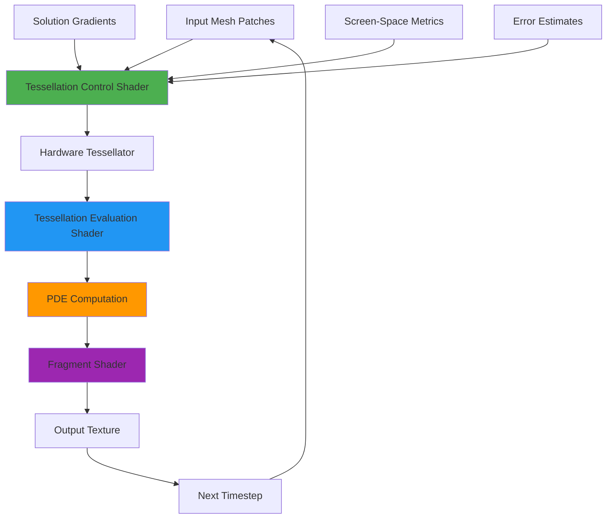
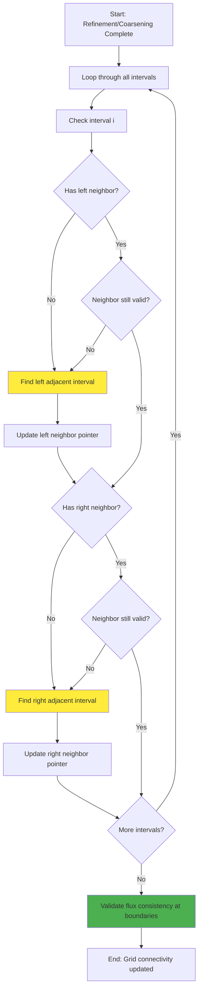
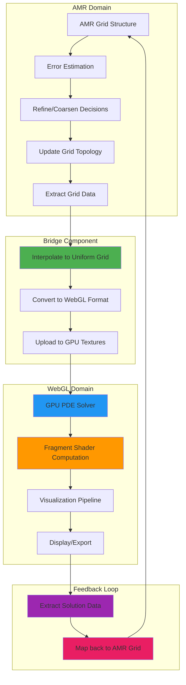

# GPU AMR Integration Analysis

Created: 2025-08-20 13:09:10 IST
Last Updated: 2025-08-20 14:33:33 IST

## Objective

Implement adaptive mesh refinement for Wheeler-DeWitt diffusion equations using proven gaming industry techniques: hardware tessellation, displacement mapping, and adaptive level-of-detail.

## Background

Current implementation uses fixed uniform grids in WebGL fragment shaders. Gaming industry has solved multi-scale GPU rendering through specialized graphics pipeline features designed for real-time performance.

## Gaming Industry Solutions Analysis

### Hardware Tessellation Pipeline
Modern GPUs provide dedicated tessellation units specifically for adaptive subdivision:
- **Tessellation Control Shader**: Determines subdivision levels based on criteria
- **Tessellation Evaluation Shader**: Generates new vertices and computes values
- **Hardware Support**: All modern GPUs (OpenGL 4.0+, WebGL extensions)

### Screen-Space Adaptive LOD
Games use screen-space coverage to determine tessellation levels:
- **Distance-based**: Far objects need less detail than near objects
- **Angular size**: Small on-screen objects need fewer polygons
- **Performance scaling**: Computational load scales with visual importance

### Displacement Mapping Integration
Displacement adds geometric detail without vertex overhead:
- **Height fields**: Store solution data as displacement textures
- **Per-pixel detail**: Fragment shader adds fine-scale features
- **View-dependent**: Detail adapts to camera position automatically

### Stochastic LOD Transitions
Eliminates "popping" artifacts between detail levels:
- **Dithered transitions**: Random pixel assignment between LOD levels
- **Cross-dissolve**: Smooth visual transitions between resolution levels
- **Temporal stability**: Consistent appearance across frames

## Recommended Approach: Tessellation-Based AMR
=======

**Phase 1: Tessellation Pipeline Conversion**
Convert existing fragment shader solver to tessellation shader pipeline:

```glsl
// Tessellation Control Shader
#version 410
layout(vertices = 4) out;
uniform float maxTessLevel;
uniform sampler2D solutionTexture;

void main() {
    // Compute adaptive tessellation level based on solution gradients
    vec2 gradientMagnitude = computeGradient(gl_in[gl_InvocationID].gl_Position);
    float tessLevel = clamp(gradientMagnitude.x * maxTessLevel, 1.0, 64.0);
    
    gl_TessLevelOuter[gl_InvocationID] = tessLevel;
    gl_TessLevelInner[0] = max(gl_TessLevelOuter[0], gl_TessLevelOuter[2]);
    gl_TessLevelInner[1] = max(gl_TessLevelOuter[1], gl_TessLevelOuter[3]);
}

// Tessellation Evaluation Shader  
#version 410
layout(quads, equal_spacing) in;
uniform float dt;
uniform sampler2D previousSolution;

void main() {
    vec2 uv = gl_TessCoord.xy;
    
    // Interpolate base position
    vec3 position = interpolateQuadPosition(uv);
    
    // Sample previous solution
    float u = texture(previousSolution, uv).r;
    float laplacian = computeLaplacian(previousSolution, uv);
    
    // Apply PDE update (telegraph equation example)
    float newU = u + dt * laplacian;
    
    gl_Position = mvpMatrix * vec4(position + vec3(0,0,newU), 1.0);
}
```

**Phase 2: Adaptive Criteria Implementation**
Combine multiple adaptation criteria:

```javascript
// Adaptive tessellation factors
const adaptiveCriteria = {
    screenSpace: computeScreenSpaceDerivative(),
    gradientMagnitude: computeSolutionGradient(), 
    temporalError: estimateTemporalError(),
    geometricCurvature: computeSurfaceCurvature()
};

const tessellationLevel = combineAdaptiveCriteria(adaptiveCriteria);
```

**Phase 3: Multi-Resolution Integration**
Use texture arrays for seamless LOD:

```glsl
uniform sampler2DArray multiResTextures;
uniform float lodBias;

void main() {
    float lod = computeAutoLOD() + lodBias;
    vec4 solution = texture(multiResTextures, vec3(uv, lod));
    // Apply PDE computation at appropriate resolution
}
```

## Tessellation Pipeline Flow



## Implementation Strategy

### Primary Approach: Hardware Tessellation

**Rationale**: Leverages dedicated GPU tessellation units designed for adaptive subdivision. Proven scalable approach used by all modern games.

**Process**:

1. Convert fragment shader pipeline to tessellation shader pipeline
2. Implement tessellation control shader for adaptive subdivision criteria
3. Implement tessellation evaluation shader for PDE computation  
4. Add multi-resolution texture support for seamless LOD transitions
5. Integrate screen-space adaptive metrics for performance optimization

### Alternative Approaches Considered

**Custom GPU-AMR Libraries**:
- GAMER-2: CPU/GPU hybrid, complex integration
- AGAL: Block-based GPU-native, requires CUDA
- GPU-accelerated cell-based: Performance penalties for irregular access

**Fragment Shader Extensions**:
- Multi-resolution textures: Limited subdivision control
- Compute shader conversion: No dedicated tessellation hardware
- Hybrid CPU-AMR: Significant CPU-GPU transfer overhead

### Why Tessellation Pipeline Wins

**Hardware Acceleration**: Dedicated tessellation units on all modern GPUs
**Proven Scalability**: Used in all AAA games for terrain and character rendering  
**Minimal Code Changes**: Leverages existing mathematical PDE solvers
**Standard APIs**: OpenGL 4.0+, WebGL extensions, DirectX 11+ support
**Automatic Optimization**: GPU handles subdivision and memory management

### Core Tessellation Components

**Tessellation Control Shader**:
```glsl
layout(vertices = 4) out;
uniform float adaptiveThreshold;
uniform sampler2D gradientTexture;

void main() {
    vec4 gradients = texture(gradientTexture, patchCoords[gl_InvocationID]);
    float tessLevel = computeAdaptiveLevel(gradients, adaptiveThreshold);
    gl_TessLevelOuter[gl_InvocationID] = tessLevel;
}
```

**Adaptive Criteria**:
1. **Screen-space derivatives**: Higher tessellation for closer objects
2. **Solution gradients**: More subdivision where `|∇u|` is large  
3. **Temporal error**: Refine where solution changes rapidly
4. **Geometric curvature**: Additional subdivision for curved surfaces

**Error Estimation**:
- Monitor solution gradients: `|∇u|` from previous timestep
- Screen-space metrics: Project edge length to pixels
- Temporal derivatives: `|∂u/∂t|` for dynamic adaptation

### Implementation Complexity

**Tessellation Pipeline Conversion**: ~150-200 lines GLSL + ~100 lines JavaScript

- Tessellation control shader for adaptive subdivision
- Tessellation evaluation shader for PDE computation
- WebGL tessellation pipeline setup
- Adaptive criteria computation

**Key Advantages**: 
- Hardware acceleration eliminates custom subdivision logic
- Automatic memory management by GPU tessellation unit
- Built-in interpolation and continuity guarantees

## Technical Considerations

### Hardware Support

**GPU Tessellation**: Available on all modern hardware

- Desktop: OpenGL 4.0+ (2010+), DirectX 11+ (2009+)
- Mobile: OpenGL ES 3.2 (2015+), Vulkan (2016+)
- WebGL: Extension support varies, fallback to fragment shaders

### Pipeline Advantages

**Hardware Tessellation Benefits**:

- **Dedicated units**: Specialized hardware for subdivision
- **Memory efficiency**: On-demand vertex generation  
- **Automatic culling**: Hardware eliminates invisible geometry
- **Load balancing**: GPU handles resource allocation
- **Standard pipeline**: Well-optimized by GPU vendors

### Integration with Current Architecture

**Current**: WebGL fragment shaders on uniform grid
**Proposed**: Tessellation pipeline with adaptive subdivision

```
Patch Definition → Tessellation Control → Hardware Tessellator → 
Tessellation Evaluation → PDE Computation → Fragment Shader → Output
```

**Migration Path**:
1. Keep existing mathematical PDE solvers
2. Convert shader pipeline from fragment to tessellation  
3. Add adaptive criteria computation
4. Integrate multi-resolution textures

## File Structure and Implementation

### Core Files Required

**Estimated total: ~440-610 lines**

```
src/amr/
├── AMRGrid.ts           (~150-200 lines)
├── AMRInterval.ts       (~50-80 lines)
├── ErrorEstimator.ts    (~80-100 lines)
├── Interpolator.ts      (~60-80 lines)
└── AMRSolver.ts         (~100-150 lines)
```

**Integration**: ~50 lines modifications to existing solver

### Core Data Structures

**AMRInterval.ts**:

```typescript
class AMRInterval {
  start: number;
  end: number;
  level: number;
  dx: number;
  values: number[];
  leftNeighbor?: AMRInterval;
  rightNeighbor?: AMRInterval;

  split(): [AMRInterval, AMRInterval];
  canCoarsen(): boolean;
  computeError(): number;
}
```

**AMRGrid.ts**:

```typescript
class AMRGrid {
  intervals: AMRInterval[];
  maxLevel: number;
  refineThreshold: number;
  coarsenThreshold: number;

  refineInterval(interval: AMRInterval): void;
  coarsenIntervals(left: AMRInterval, right: AMRInterval): void;
  updateNeighborConnections(): void;
  adaptGrid(): void;
  toUniformGrid(targetSize: number): number[];
  getMaxError(): number;
}
```

**ErrorEstimator.ts**:

```typescript
class ErrorEstimator {
  gradientThreshold: number;
  curvatureThreshold: number;

  computeGradientError(interval: AMRInterval): number;
  computeCurvatureError(interval: AMRInterval): number;
  computeRichardsonError(interval: AMRInterval): number;
  shouldRefine(interval: AMRInterval): boolean;
  shouldCoarsen(interval: AMRInterval): boolean;
}
```

**Interpolator.ts**:

```typescript
class Interpolator {
  static linearInterpolate(
    x: number,
    x1: number,
    y1: number,
    x2: number,
    y2: number
  ): number;
  static interpolateToFinerLevel(coarseInterval: AMRInterval): number[];
  static restrictToCoarserLevel(
    fineLeft: AMRInterval,
    fineRight: AMRInterval
  ): number[];
  static interpolateAtBoundary(
    leftInterval: AMRInterval,
    rightInterval: AMRInterval,
    position: number
  ): number;
}
```

**AMRSolver.ts**:

```typescript
class AMRSolver {
  grid: AMRGrid;
  errorEstimator: ErrorEstimator;
  interpolator: Interpolator;
  equation: PDEDefinition;

  solveTimestep(dt: number): void;
  adaptMesh(): void;
  convertToUniformGrid(targetResolution: number): UniformGridData;
  integrateWithWebGL(): void;
  validateConservation(): boolean;
}

interface UniformGridData {
  x: number[];
  values: number[];
  dx: number;
}

interface PDEDefinition {
  computeRHS(u: number[], x: number[], dx: number): number[];
  applyBoundaryConditions(u: number[], x: number[]): void;
}
```

**File breakdown**:

- `AMRInterval.ts`: Data structure for grid intervals with neighbor tracking
- `AMRGrid.ts`: Grid management, refinement/coarsening logic, uniform conversion
- `ErrorEstimator.ts`: Gradient/curvature-based error indicators
- `Interpolator.ts`: Linear interpolation between resolution levels
- `AMRSolver.ts`: PDE solving on adaptive grid + WebGL integration

### Integration with Existing WebGL Solver

**Total integration effort: ~165 lines** across existing files plus bridge component.

**1. Modify existing WebGL solver**:

```typescript
// In useWebGLSolver.ts (~20 lines)
interface SolverConfig {
  useAMR: boolean;
  amrConfig?: AMRConfig;
}

// In webgl-solver.js (~30 lines)
class WebGLSolver {
  amrSolver?: AMRSolver;

  setAMRMode(enabled: boolean): void;
  updateFromAMR(uniformData: UniformGridData): void;
}
```

**2. Create AMR-WebGL bridge**:

```typescript
// New file: AMRWebGLBridge.ts (~100 lines)
class AMRWebGLBridge {
  amrSolver: AMRSolver;
  webglSolver: WebGLSolver;

  syncAMRToWebGL(): void;
  extractWebGLToAMR(): void;
  handleResolutionMismatch(): void;
}
```

**3. Update UI controls**:

```typescript
// In Controls.tsx (~15 lines)
<AMRControls
  enabled={amrEnabled}
  refineThreshold={refineThreshold}
  maxLevel={maxLevel}
  onConfigChange={handleAMRConfig}
/>
```

**Integration workflow**:

1. AMR solver computes adaptive timestep
2. Convert AMR grid to uniform resolution via `toUniformGrid()`
3. Upload uniform data to WebGL textures
4. Existing WebGL visualization pipeline unchanged
5. Extract solution back to AMR grid for next timestep

## Next Steps

1. **Research phase**: Evaluate existing JavaScript spatial data structures
2. **Prototype**: Basic 1D interval refinement without PDE solving
3. **Integration**: Connect AMR grid to uniform grid conversion
4. **Testing**: Compare performance vs fixed grid approaches
5. **Validation**: Verify conservation properties and accuracy

## Performance Expectations

**Benefits**:

- Computational efficiency in smooth regions
- High resolution near solution features
- Adaptive timestep potential

**Costs**:

- AMR overhead (refinement decisions, interpolation)
- CPU-GPU data transfer for uniform grid conversion
- Memory overhead for AMR tree structure

**Target**: 2-5x performance improvement for problems with localized features compared to equivalent uniform grid resolution.

## AMR Algorithm Diagrams

### Neighbor Connection Update Process



### AMR-WebGL Bridge Data Flow


