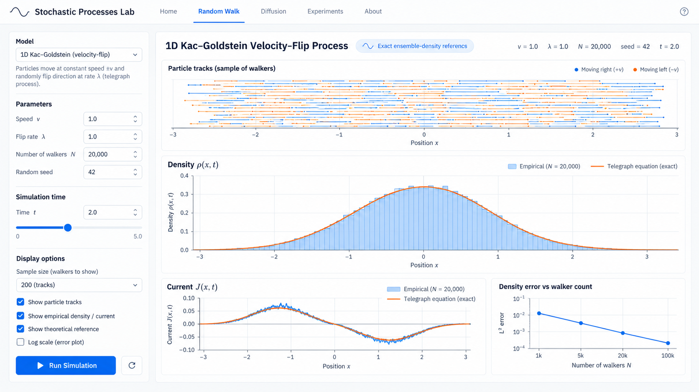
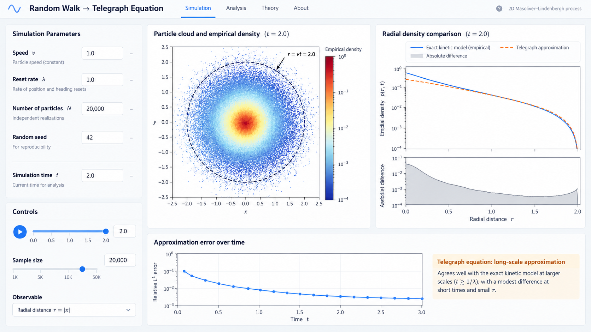

# Random Walk Continuum Comparison Mockups

*Created: 2026-09-30 06:01 IST*

These generated images are UI concepts for showing how random-walk ensembles compare with continuum predictions. They are not computed simulation output and do not establish numerical agreement.

## 1D Kac–Goldstein

The concept pairs empirical density and current with the telegraph reference, then shows how density error changes with walker count.

## 2D Masoliver–Lindenbergh

The radial plot shown here applies only to a centered, isotropic point-source initial condition. Since the app supports other initial conditions, the general comparison should use matched $x$-$y$ heatmaps for empirical density, continuum prediction, and their difference. Keep radial comparison as an optional view when the setup has the required symmetry. Label the telegraph equation as a long-scale approximation; the kinetic position-heading model is the exact continuum reference.
