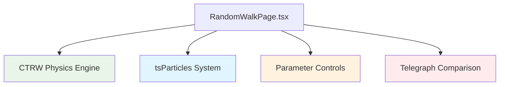
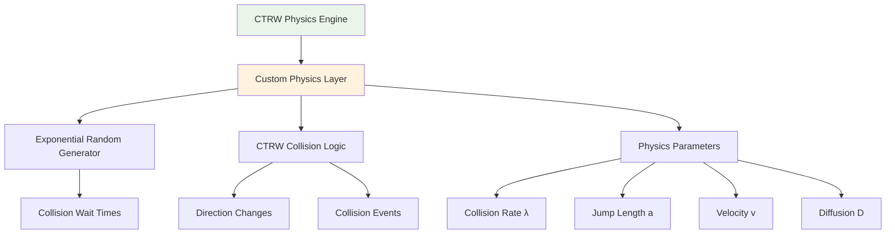
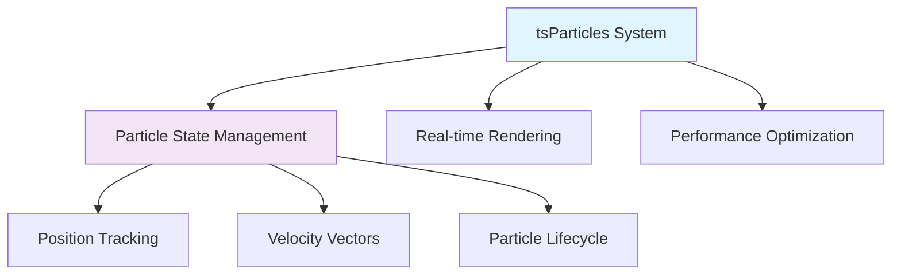
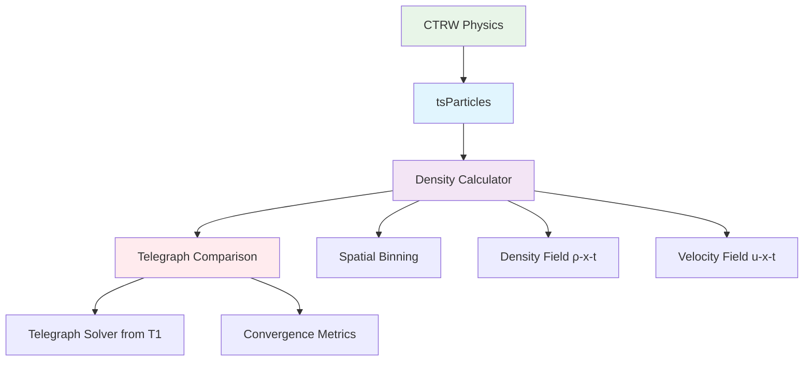
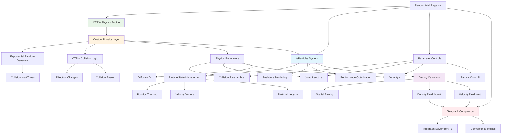
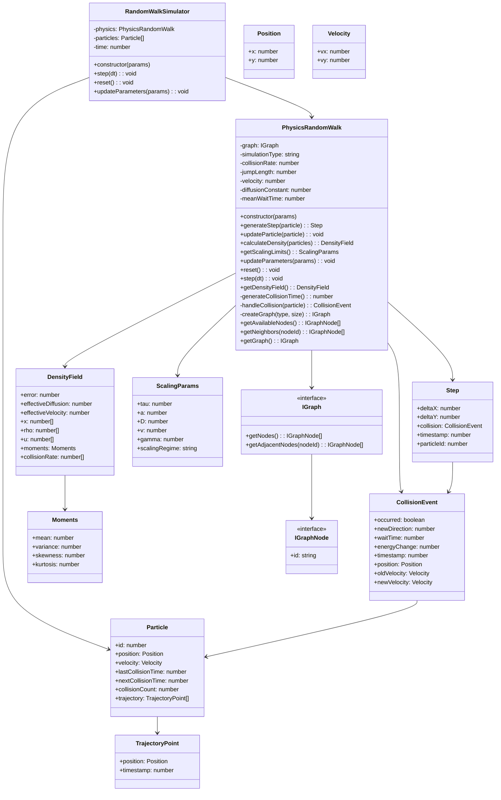
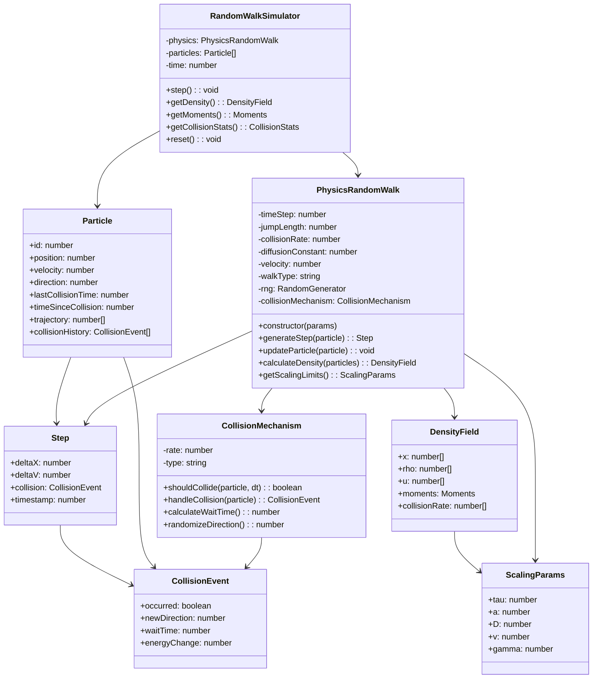

# Random Walk Derivation of Telegraph Equation

_Created: 2025-08-20 23:50:59 IST_

## Overview

This document outlines the implementation steps for demonstrating how the telegraph equation emerges from discrete random walk processes in the appropriate continuum limits.

### High-Level Component Structure



### CTRW Physics Engine Detail



### tsParticles Integration



### Data Processing Pipeline



**Architecture Notes**:

**What tsParticles Handles**:

- ✅ Particle state management (position, velocity, lifecycle)
- ✅ Real-time rendering and animation
- ✅ Performance optimization for large N

**What Custom Physics Handles**:

- ❌ Exponential random wait times
- ❌ CTRW collision detection and timing
- ❌ Physics parameter relationships

**Key Insight**: Clean separation between physics (CTRW) and rendering (tsParticles)

## Component Architecture



# Actual Random Walk Class Structure



**Updated Architecture Notes**:

**tsParticles Handles**:

- ✅ Particle state management (position, velocity, lifecycle)
- ✅ Real-time rendering and animation loop
- ✅ Performance optimization for large N
- ✅ Memory management

**Custom Physics Layer Handles**:

- ❌ Exponential random number generation for wait times
- ❌ CTRW collision timing and detection
- ❌ Physics parameter relationships (λ, v, D)

**Separate Components**:

- **Density Calculator**: Bridges discrete particles → continuous fields
- **Telegraph Comparison**: Validates CTRW vs analytical solutions

**Data Flow**:

1. **Custom Physics** generates collision events with exponential timing
2. **tsParticles** manages particle states and renders visually
3. **Density Calculator** bins particle data → continuous density/velocity fields
4. **Telegraph Comparison** compares fields against T1 analytical solver

## Random Walk Class Structure



## Mathematical Background

### Random Walk Model

- **Discrete particles** performing random walks on a lattice
- **Jump probability**: p (left/right with equal probability)
- **Time step**: τ (mean time between jumps)
- **Jump length**: a (lattice spacing)
- **Collision frequency**: γ = 1/τ

### Continuum Limit

As τ → 0, a → 0, with constraints:

- **Diffusion coefficient**: D = a²/(2τ) = constant
- **Velocity**: v = a/τ = constant
- **Collision rate**: γ = 1/τ

## Implementation Steps

### Phase 1: Discrete Random Walk Simulation

1. **Particle System**

   - Create N particles on 1D lattice
   - Each particle has position x_i(t) and velocity v_i(t)
   - Initialize particles at origin or Gaussian distribution

2. **Jump Dynamics**

   - At each time step τ, particle jumps ±a with probability 1/2
   - Implement collision mechanism with frequency γ
   - Track particle positions over time

3. **Visualization**

   - Real-time particle position scatter plot
   - Density histogram showing particle distribution evolution
   - Individual particle trajectory traces

### Phase 2: Moment Equations

1. **Density Calculation**

   - Bin particles into spatial cells
   - Calculate local density ρ(x,t) = number of particles per unit length
   - Track first moment (mean position) and second moment (variance)

2. **Velocity Field**

   - Track local average velocity u(x,t) = ⟨v⟩ at each position
   - Show how velocity field evolves with density

3. **Conservation Laws**

   - Verify particle number conservation
   - Show momentum conservation with collisions

### Phase 3: Continuum Limit Demonstration

1. **Parameter Scaling**

   - Interactive sliders for τ, a, γ
   - Show how different scaling regimes lead to different equations
   - Critical scaling: a²/τ = constant, a/τ = constant

2. **Equation Derivation**

   - **Diffusion limit**: τ → 0 faster than a → 0 gives ∂ρ/∂t = D∇²ρ
   - **Telegraph limit**: τ, a → 0 with v = a/τ constant gives telegraph equation
   - **Hyperbolic limit**: a → 0 faster than τ → 0 gives wave equation

3. **Convergence Verification**

   - Compare random walk density evolution with telegraph equation solution
   - Show convergence as τ → 0 with proper scaling
   - Error analysis and convergence rates

### Phase 4: Interactive Demonstration

1. **Parameter Controls**

   - Number of particles: N = 100, 1000, 10000
   - Time step: τ = 0.1, 0.01, 0.001
   - Jump length: a = 1.0, 0.1, 0.01
   - Collision rate: γ = 0.1, 1.0, 10.0

2. **Visualization Modes**

   - **Particle view**: Individual particle positions and trajectories
   - **Density view**: Smoothed density field ρ(x,t)
   - **Comparison view**: Random walk vs telegraph equation solution side-by-side
   - **Phase space**: (position, velocity) distribution

3. **Real-time Analysis**

   - Calculate moments: ⟨x⟩, ⟨x²⟩, ⟨v⟩, ⟨v²⟩
   - Show how telegraph equation coefficients emerge
   - Display convergence metrics and scaling relationships

## Technical Implementation

### Framework Choice

- **React component**: Integrate with existing T1 architecture
- **WebGL acceleration**: Use for large particle simulations (N > 1000)
- **Canvas rendering**: Real-time particle visualization
- **Plotly integration**: Density plots and comparison charts

### Data Structures

```typescript
interface Particle {
  position: number;
  velocity: number;
  id: number;
}

interface RandomWalkParams {
  numParticles: number;
  timeStep: number;
  jumpLength: number;
  collisionRate: number;
  totalTime: number;
}

interface DensityField {
  x: number[];
  rho: number[];
  u: number[]; // velocity field
}
```

### Performance Considerations

- **Spatial hashing**: Efficient density calculation for large N
- **WebGL compute shaders**: Parallel particle updates
- **Adaptive time stepping**: Maintain numerical stability
- **Memory management**: Efficient particle storage and updates

## Physics Validation

### Theoretical Predictions

1. **Einstein relation**: D = v²τ/2 in telegraph limit
2. **Wave speed**: c = v in hyperbolic limit
3. **Diffusion recovery**: D = a²/(2τ) in diffusion limit

### Convergence Tests

1. **Strong convergence**: |ρ_random(x,t) - ρ_telegraph(x,t)| → 0 as τ → 0
2. **Moment matching**: ⟨x²⟩\_random ≈ ⟨x²⟩\_telegraph for small τ
3. **Scaling verification**: Verify D, v scale correctly with τ, a

## Integration with Existing Code

### Dependencies

- **T1 task**: Use existing telegraph equation solver for comparison
- **WebGL solver**: Leverage existing GPU acceleration infrastructure
- **UI components**: Reuse parameter controls and visualization components

### File Structure

```
frontend/src/
├── RandomWalkPage.tsx          # Main random walk demonstration page
├── components/
│   ├── RandomWalkSimulation.tsx # Core simulation component
│   ├── ParticleRenderer.tsx     # WebGL particle visualization
│   └── DensityComparison.tsx    # Random walk vs telegraph comparison
├── hooks/
│   └── useRandomWalk.ts         # Random walk simulation logic
└── utils/
    ├── randomWalkSolver.ts      # Discrete particle simulation
    └── momentCalculations.ts    # Statistical analysis functions
```

## Success Criteria

1. **Accurate convergence**: Random walk density converges to telegraph equation solution
2. **Parameter scaling**: Correct scaling relationships for D, v, γ
3. **Interactive exploration**: Users can explore different scaling regimes
4. **Educational value**: Clear demonstration of stochastic → deterministic connection
5. **Performance**: Smooth real-time simulation for N ≤ 10,000 particles
6. **Integration**: Seamless integration with existing T1 telegraph equation solver

## Existing Random Walk Implementations Analysis

### Available npm Packages Evaluation

| Package            | Stars/Downloads | Physics Control              | Collision Support | Telegraph Equation | Verdict         |
| ------------------ | --------------- | ---------------------------- | ----------------- | ------------------ | --------------- |
| `random-walk`      | 5/week          | ❌ Basic volatility only     | ❌                | ❌                 | Too basic       |
| `random`           | 217 projects    | ⚠️ Distribution control      | ❌                | ❌                 | General purpose |
| `series-generator` | Low usage       | ⚠️ Gaussian walks            | ❌                | ❌                 | Limited scope   |
| `random-js`        | 314 projects    | ✅ Full distribution control | ❌                | ❌                 | Good foundation |

**Conclusion**: No existing npm packages provide the physics parameters needed (collision rate, velocity, diffusion constant, telegraph equation support).

### Academic Implementation Frameworks

| Framework                    | Language | Physics Completeness  | Collision Mechanism   | Implementation Quality      |
| ---------------------------- | -------- | --------------------- | --------------------- | --------------------------- |
| **CTRW (Montroll-Weiss)**    | Theory   | ✅ Complete           | ✅ Poisson process    | ✅ Rigorous foundation      |
| **Kac's Monte Carlo**        | Python   | ✅ Telegraph equation | ✅ Collision dynamics | ✅ Validated implementation |
| **celltrackR**               | R        | ✅ Biological walks   | ✅ Turning events     | ✅ Production ready         |
| **SiddharthP96/RandomWalks** | MATLAB   | ⚠️ Various types      | ⚠️ Limited collision  | ⚠️ Educational              |

### Best Collision Mechanisms Found

#### 1. Continuous Time Random Walk (CTRW) - MOST PROMISING

**Mathematical Foundation (Montroll-Weiss 1965):**

- **Waiting times**: τ ~ Exponential(λ) for telegraph equation
- **Jump lengths**: Fixed step size δ
- **Collision rate**: λ (Poisson process parameter)
- **Velocity**: v = δ/⟨τ⟩
- **Diffusion coefficient**: D = v²/(2λ)

**Algorithm:**

```
1. Initialize: particle position, velocity, direction
2. Sample waiting time: τ ~ Exponential(λ)
3. Move: position += velocity * τ
4. Collision event: randomize direction
5. Repeat from step 2
```

#### 2. Telegraph Process (Royal Society Interface)

**Key Features:**

- Fixed velocity v between collisions
- Collision rate λ (Poisson process)
- Direction persistence until collision
- Natural scaling to telegraph equation

**Implementation Details:**

- Probability of turning: r = λτ for time step τ
- Direction change: ±1 with equal probability
- Mean free path: ⟨distance⟩ = v/λ

#### 3. Kac's Monte Carlo Method (Zhang et al. 2018)

**Implementation**: `bolongz/MC_Telegraph_Equations` (Python)

- Direct Monte Carlo simulation of telegraph equation
- Particle-based approach with collision dynamics
- Validated against analytical solutions
- Multiple algorithms for different scenarios

### Physics Parameter Comparison

| Parameter          | CTRW Framework    | Telegraph Process | Kac's Method   | Our Needs   |
| ------------------ | ----------------- | ----------------- | -------------- | ----------- |
| Collision Rate (γ) | ✅ λ parameter    | ✅ λ parameter    | ✅ Built-in    | ✅ Required |
| Velocity (v)       | ✅ δ/⟨τ⟩          | ✅ Fixed v        | ✅ Implicit    | ✅ Required |
| Diffusion (D)      | ✅ v²/(2λ)        | ✅ v²/(2λ)        | ✅ Derived     | ✅ Required |
| Jump Length (a)    | ✅ δ parameter    | ✅ δ parameter    | ✅ Implicit    | ✅ Required |
| Time Step (τ)      | ✅ Exponential(λ) | ✅ Fixed/random   | ✅ Monte Carlo | ✅ Required |
| Scaling Control    | ✅ Full control   | ✅ Full control   | ⚠️ Limited     | ✅ Required |

### Recommended Implementation Strategy

**Approach**: Build custom CTRW-based implementation using physics principles

**Why not use existing packages:**

1. **npm packages lack physics parameters**
2. **Academic implementations are research-specific**
3. **Need integration with React/tsParticles ecosystem**
4. **Require real-time parameter control for education**

**Implementation Plan:**

```typescript
class PhysicsRandomWalk {
  // Core CTRW parameters
  private collisionRate: number; // λ (Poisson process rate)
  private jumpLength: number; // a (lattice spacing)
  private velocity: number; // v = a/⟨τ⟩

  // Derived parameters
  private diffusionConstant: number; // D = v²/(2λ)
  private meanWaitTime: number; // ⟨τ⟩ = 1/λ

  // Collision mechanism (CTRW approach)
  generateCollisionTime(): number {
    return -Math.log(Math.random()) / this.collisionRate; // Exponential(λ)
  }

  handleCollision(particle: Particle): void {
    particle.direction *= -1; // or random ±1
    particle.lastCollisionTime = currentTime;
  }
}
```

**Integration with tsParticles:**

- Use tsParticles for rendering and visual effects
- Custom physics layer for random walk simulation
- Real-time parameter controls for educational exploration
- Density calculation and telegraph equation comparison

## Future Extensions

1. **2D random walks**: Extension to 2D lattices and anisotropic diffusion
2. **Non-uniform collisions**: Spatially varying collision rates
3. **Memory effects**: Non-Markovian random walks and fractional derivatives
4. **Quantum connections**: Bridge to quantum mechanical diffusion processes
5. **Advanced collision models**: Velocity-dependent collision rates, boundary effects
6. **Anomalous diffusion**: Power-law waiting times and Lévy flights
